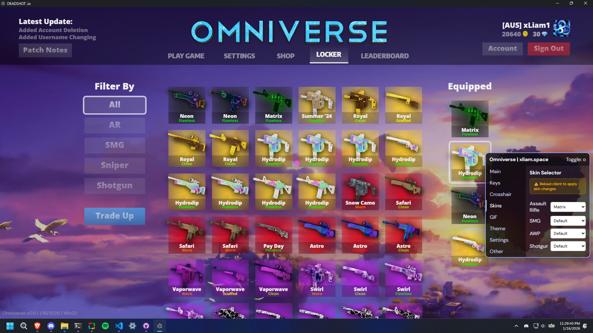

<p align="center">
  
</p>
<p align="center">
<b>A modern, easy to use Deadshot.io client.</b>

<div align="center">
  
  <br>
  <i>Preview of Omniverse 0.78's Default Config</i> 
</div>
<div align="center">
  
  <br>
  <i>Yes, you can spoof matrix</i> 
</div>
## DO NOT DISTRIBUTE WITHOUT CREDIT
## Download:
https://github.com/Typhoonz0/omniverse/releases/
## Run from source:
```bash
git clone https://github.com/Typhoonz0/omniverse.git
cd omniverse
npm install
npm start
```
## Features:
- [x] FPS Booster (literally triples your FPS)
- [x] Keys Overlay - WASD C, R, Left/Right click 
- [x] PC Stats - Just FPS + Ping or with Platform + CPU Cores
- [x] Gun skin swapper 
- [x] Uses half the RAM of Quasar
- [x] Customizable UI
- [x] Leaderboard scraper
- [x] Auto Fullscreen
- [x] Adblocker
- [x] Discord RPC
- [ ] Aimbot soon trust 

## The UI is not coming up!
Happens a lot on windows try:
- Running the app a second time
- Renaming the root folder from 'omniverse-main' to simply 'omniverse'
- In compiled releases, copying resources/app to resources/omniverse (yes i know its stupid)
- Open an issue

## I have a white screen!
This is an Electron issue, try these steps and **restart the client** each time until it works:
- Connect to Internet
- Close all Omniverse windows 
- Restart your computer
- Remove `C:/Users/name/AppData/Roaming/deadshot-viewer` or `/home/user/.config/deadshot-viewer`
- Open an issue

## How to swap your guns:

Replace the example images inside the `swap/` directory, and reload  the client. Make sure the names are EXACTLY the same as below.

This is in `<omniverse folder location>/resources/app/swap` or `<omniverse folder location>/src/swap`
```
swap/
└── weapons
    ├── ar2
    │   └── arcomp.webp
    ├── awp
    │   └── newawpcomp.webp
    ├── shotgun
    │   └── shotguncomp.webp
    └── vector
        └── vectorcomp.webp
```


