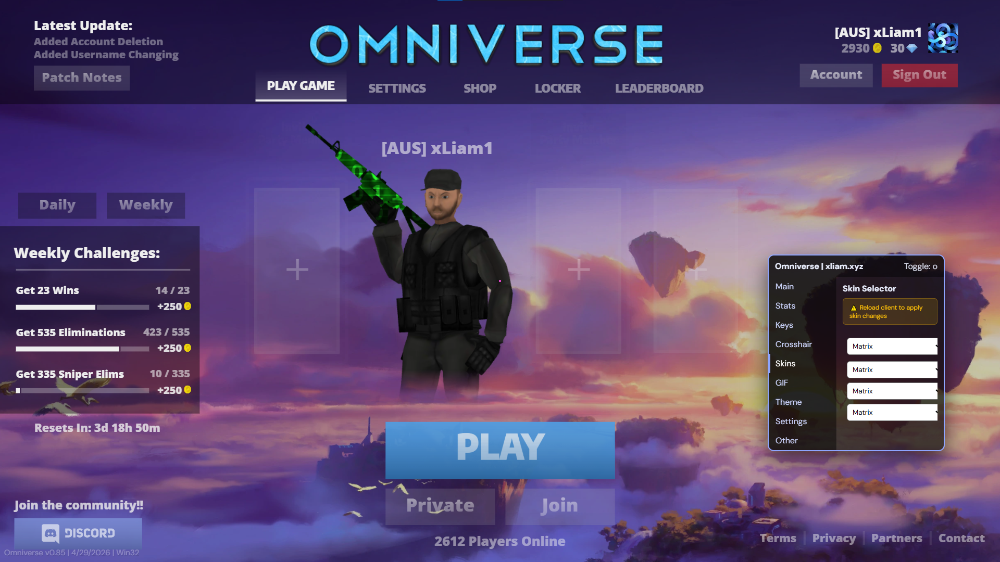

<p align="center">
  
</p>
<p align="center">
<b>The best and only working Deadshot.io client.</b>

<div align="center">
  
  <br>
  <i>Preview of Omniverse 0.85's Default Config</i> 
</div>

> [!TIP]
> Please star this repo! I've been working on this client for a long time.

> [!CAUTION]
> Please do not distribute Omniverse or its source code without crediting me.

> [!NOTE]
> Check this repo if Omniverse stops working, I'll probably have a fix in a little while.

## Download:
https://github.com/Typhoonz0/omniverse/releases/

## Run from source:
```bash
git clone https://github.com/Typhoonz0/omniverse.git
cd omniverse
npm install
npm start
```

## Features:
- [x] Use any skin in the game (e.g. Matrix, Neon, 1st Birthday)
- [x] FPS Uncapper
- [x] Keys Overlay - WASD C, R, Left/Right click 
- [x] PC Stats - Just FPS + Ping or with Platform + CPU Cores
- [x] Gun skin swapper 
- [x] Uses half the RAM of Quasar
- [x] Customizable UI
- [x] Leaderboard scraper
- [x] Auto Fullscreen
- [x] Adblocker
- [x] Discord RPC

## Stuff doesn't work!
Try these steps and **restart the client** each time until it works:
- Close all Omniverse windows 
- Delete old folders of omniverse on ur pc only keep the newest one
- Running the app a second time
- Restart your computer
- Renaming the root folder from 'omniverse-main' to simply 'omniverse'
- In compiled releases, copying resources/app to resources/omniverse (yes i know its stupid)
- Remove `C:/Users/name/AppData/Roaming/deadshot-viewer` or `/home/user/.config/deadshot-viewer`
- Wait a little
- Open an issue

## How to use the resource swapper:
Replace the example images inside the `swap/` directory, and reload the client. 
This is in `<omniverse folder location>/resources/app/src/swap` or `<omniverse folder location>/src/swap`.

```
For example, this is how you swap your default weapon skins:

swap/
└── weapons
    ├── ar2
    │   └── arcomp.webp
    ├── awp
    │   └── newawpcomp.webp
    ├── shotgun
    │   └── shotguncomp.webp
    └── vector
        └── vectorcomp.webp
```


