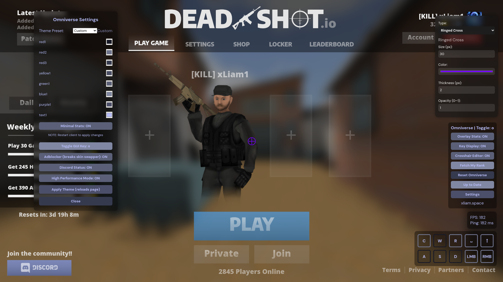

<p align="center">
  
</p>
<p align="center">
<b>A modern, easy to use Deadshot.io client.</b>

<p align="center">
  
  <i>Preview of Omniverse 0.2</i>
</p>


## DO NOT DISTRIBUTE WITHOUT CREDIT
## Download:
https://github.com/Typhoonz0/omniverse/releases/

## Run from source:
```bash
git clone https://github.com/Typhoonz0/omniverse.git
cd omniverse
npm install
npm start
```
## Features:

- [x] Keys Overlay - WASD C, R, Left/Right click 
- [x] PC Stats - FPS, Ping, Platform, Total Memory (buggy), CPU Cores
- [x] Gun skin swapper
- [x] Customizable UI
- [x] Leaderboard scraper
- [x] Auto Fullscreen
- [ ] Aimbot soon trust 

## How to swap your guns:
Replace the example images inside the `swap/` directory, and reload  the client. Make sure the names are EXACTLY the same as below.
```
swap/
└── weapons
    ├── ar2
    │   └── arcomp.webp
    ├── awp
    │   └── newawpcomp.webp
    ├── shotgun
    │   └── shotguncomp.webp
    └── vector
        └── vectorcomp.webp
```
